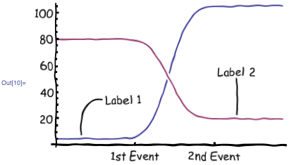

# A test topic

This is the overview text. For more information, please re-read.

## The thing itself

This section needs an unordered list.

Here goes:

* my hovercraft
* might or
* might not be
* full of eels

So there.



*Sadly, the syntax does not support captions out of the box.*

## Another section

This one has a code sample.

```javascript {.codeblock}
function adder(adj) {
   console.error(`I have a ${adj} plan.`)
}

adder(cunning);
```

Also, [a link](test-topic-2.md)!

---

[Back to index](http://dtce-jenkins.duckdns.org:8080/).

---
